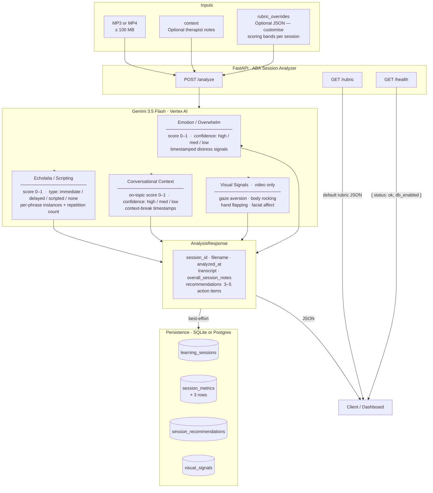

# ABA Session Analyzer — API Reference

## Request / Response Flow



## Endpoints

| Method | Path | Description |
|--------|------|-------------|
| `POST` | `/analyze` | Upload MP3 or MP4, receive full `AnalysisResponse` |
| `GET` | `/rubric` | Return the default scoring rubric (use as template for `rubric_overrides`) |
| `GET` | `/health` | Liveness check — `{ "status": "ok", "db_enabled": bool }` |

### POST /analyze — form fields

| Field | Required | Description |
|-------|----------|-------------|
| `audio` | Yes | MP3 (`audio/mpeg`) or MP4 (`video/mp4`), max 20 MB |
| `context` | No | Free-text therapist notes prepended to the Gemini prompt |
| `rubric_overrides` | No | JSON object; top-level keys (`emotion_overwhelm`, `echolalia_scripting`, `conversational_context`) replace the corresponding default rubric section |

## Core Analysis Metrics

| Metric | Measures | Score | Bands |
|--------|----------|-------|-------|
| **Emotion / Overwhelm** | Distress cues in audio | 0–1 | Minimal · Mild · Moderate · Elevated · Severe |
| **Echolalia / Scripting** | Echoed/scripted utterances as % of speech | 0–1 | Absent · Occasional · Frequent · Predominant · Pervasive |
| **Conversational Context** | How well student tracks therapist's topic | 0–1 | On-topic · Mostly on-topic · Partial · Mostly off-topic · Disconnected |
| **Visual Signals** *(video only)* | Stimming behaviors from the visual stream | per-signal | `gaze_aversion` · `body_rocking` · `hand_flapping` · `tip_toeing` · `facial_affect` |

All metrics include a `confidence` rating (`high` / `medium` / `low`) and a human-readable `summary`.

## Database Schema

```
learning_sessions          1 ──< session_metrics         (3 rows per session)
                           1 ──< session_recommendations  (3–5 rows per session)
                           1 ──< visual_signals           (video sessions only)
```

Persistence is **opt-in**: set `DATABASE_URL` in `.env` to enable. The API returns results regardless of DB state — failures are swallowed silently so a DB outage never blocks analysis.
