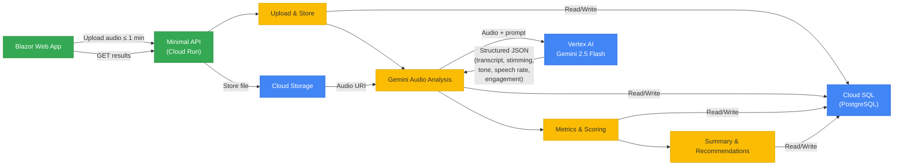
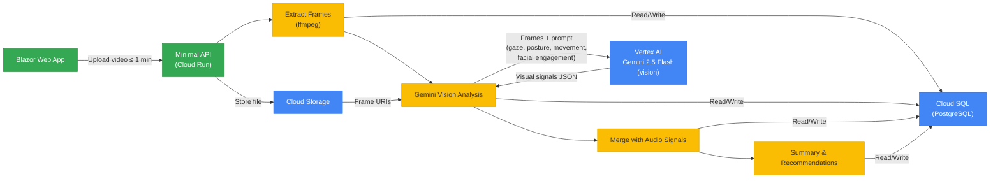

# Architecture Diagram — AI-Powered Learning Command Center

> **Hackathon scope:** Single Cloud Run container. Target ≤ 60 s per clip.

---

## Audio Analysis (Core)

---

## Video Analysis (Stretch Goal)

---

## Why Gemini 2.5 Flash for Audio (not Speech-to-Text)

Standard Speech-to-Text only produces text — it discards prosodic and non-verbal signals. Gemini 2.5 Flash accepts raw audio and returns all of the following in a **single structured call**:

| Signal             | What it captures                                         |
| ------------------ | -------------------------------------------------------- |
| Transcription      | Timestamped speech segments                              |
| Stimming detection | Repetitive vocalizations, humming, non-word sounds       |
| Tone / affect      | Emotional coloring — calm, anxious, excited, flat        |
| Speech rate        | Words per minute, pauses, hesitation patterns            |
| Engagement energy  | Volume dynamics, sustained attention vs. withdrawal cues |

Model: `gemini-2.5-flash-preview-05-20` (via Vertex AI). For 1-minute clips, typical latency is 10–25 s.
