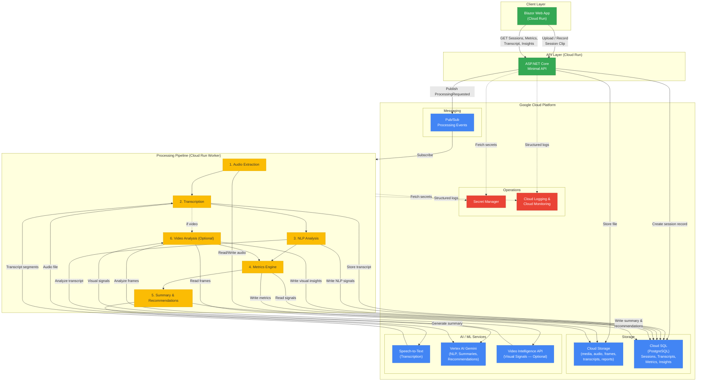

# Architecture Diagram — AI-Powered Learning Command Center



## Component Summary

| Component                  | Technology               | Purpose                                                                    |
| -------------------------- | ------------------------ | -------------------------------------------------------------------------- |
| Blazor Web App             | .NET 10 / Blazor         | Facilitator dashboard — upload, view metrics, transcript, timeline         |
| Minimal API                | ASP.NET Core / Cloud Run | REST API for all client interactions                                       |
| Cloud Run Worker           | .NET 10 / Cloud Run      | Async processing pipeline triggered by Pub/Sub                             |
| Cloud Storage              | GCP                      | Stores uploaded media, extracted audio, video frames, reports              |
| Cloud SQL (PostgreSQL)     | GCP                      | Persists sessions, transcript segments, metrics, insights, recommendations |
| Pub/Sub                    | GCP                      | Decouples upload from processing; triggers worker                          |
| Speech-to-Text             | GCP                      | Generates timestamped transcript from audio                                |
| Vertex AI Gemini           | GCP                      | NLP analysis, session summaries, recommended interventions                 |
| Video Intelligence API     | GCP (optional)           | Extracts visual engagement signals from video frames                       |
| Secret Manager             | GCP                      | Stores connection strings, API keys                                        |
| Cloud Logging / Monitoring | GCP                      | Structured observability across all services                               |

## Processing Pipeline States

```
Uploaded → Extracting → Transcribing → Analyzing → Scoring → Summarizing → Complete
                                                                            ↓
                                                                         Failed (any step)
```
